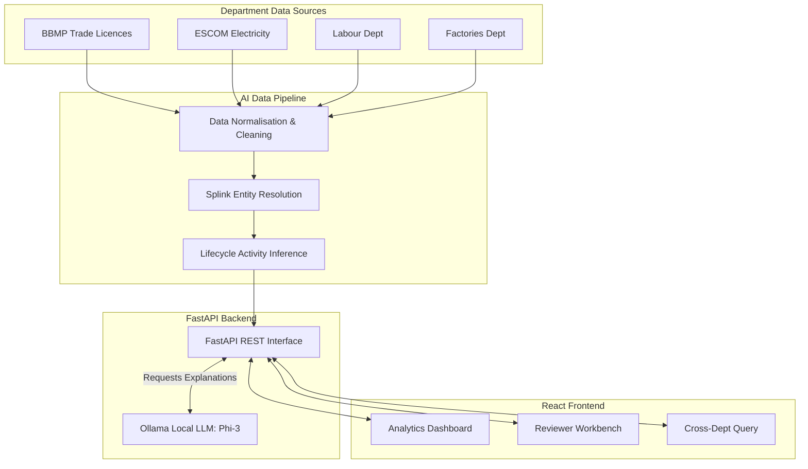

# UBID Platform Prototype

The **Unified Business Identifier (UBID) Platform** is an AI-powered data engine and web dashboard designed to resolve, link, and monitor business entities across siloed government departments in Karnataka.

By aggregating disparate, messy records from systems like BBMP (Trade Licences), ESCOM (Electricity), Labour, and Factories, the UBID platform uses AI-driven entity resolution (via Splink/Fellegi-Sunter) to identify true business entities and assigns them a unique **UBID**.

## Key Features
* **AI Entity Resolution:** Uses probabilistic linkage to automatically group records that belong to the same business despite typos, missing IDs, or differing addresses.
* **Activity Monitor & Lifecycle Inference:** Decays signal weights over time (e.g. paying an electricity bill vs passing an inspection) to intelligently categorize a business as **ACTIVE**, **DORMANT**, or **CLOSED**.
* **Reviewer Workbench:** Flags ambiguous matches (55%-84% confidence) for manual verification by a human analyst.
* **Cross-Department Query Engine:** Allows filtering across departments (e.g., finding all ACTIVE factories in a specific pin code that haven't had an inspection in 18 months).
* **LLM Explanations:** Uses local Ollama models (like Phi-3) to generate natural language explanations for AI matching decisions.

## System Architecture

## Role of the Local LLM (Phi-3)
The platform integrates a **local instance of Microsoft's Phi-3 model via Ollama** to provide critical context for human-in-the-loop decisions.

When the primary AI Engine (Splink) flags an ambiguous record match (e.g., a 72% confidence score), it sends the raw matching evidence to the backend. The FastAPI server then securely prompts the local Phi-3 model with these signals. 

**Phi-3's responsibilities:**
1. **Explainability:** Translates complex statistical weights and similarity scores into a plain English, one-sentence summary.
2. **Reviewer Assistance:** Highlights the decisive factors (e.g., "These records share the same PAN identifier, providing strong evidence they are the same business...").
3. **Data Privacy:** Because Phi-3 runs completely locally via Ollama, sensitive government data never leaves the host machine.

## Tech Stack
* **AI Engine:** Python, Pandas, DuckDB, Splink (v3)
* **Backend:** FastAPI, Python 3.11, Uvicorn
* **Frontend:** React, Vite, React Router, Recharts, standard CSS (Dark Theme)

For setup and running instructions, please see [RUN_INSTRUCTIONS.md](./RUN_INSTRUCTIONS.md).
